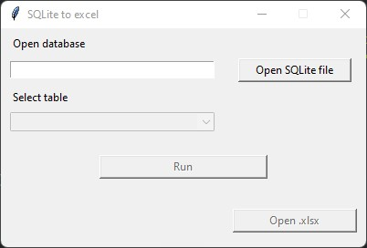

## Description:
Tool to export SQLite database tables to Excel table with GUI.

## Usage

1. Open sqlite database file
2. Select the table what you want to export
3. Run

Your file will be saved the same directory where your database file in.
You can open xlsx file directly from program.

## Requirements:
- Pandas

## Contributing:
If you have any advice or like to contribute, feel free to report issues, start new discussions, or create pull requests.
